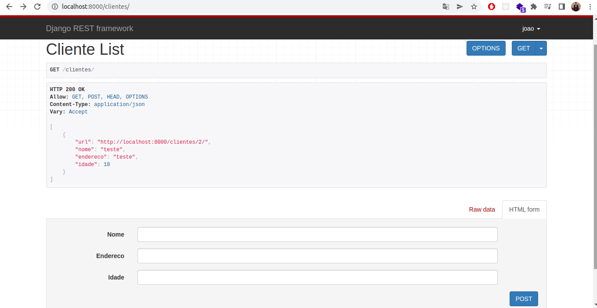
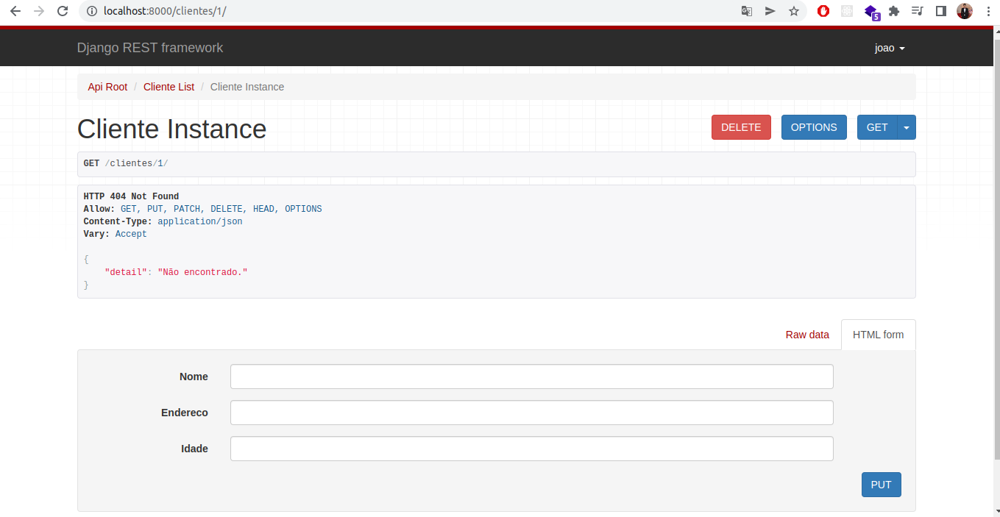

# Aplicação Django Rest Framework

## Iniciando com o Django Rest Framework, CRUD cliente.

### 🛠 Tecnologias

As seguintes ferramentas foram usadas na construção do projeto:

- [Django](https://www.djangoproject.com/)
- [Django-rest-framework](https://www.django-rest-framework.org/)
- [Python](https://www.python.org/)